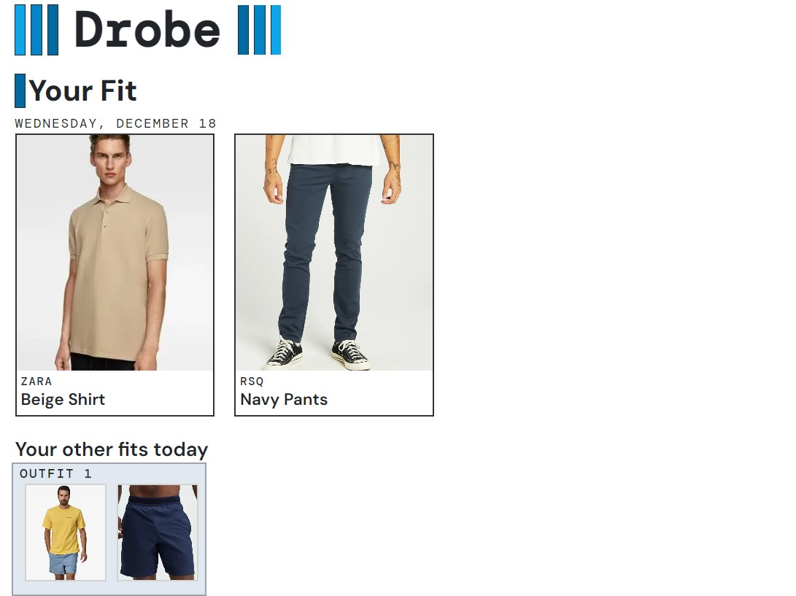
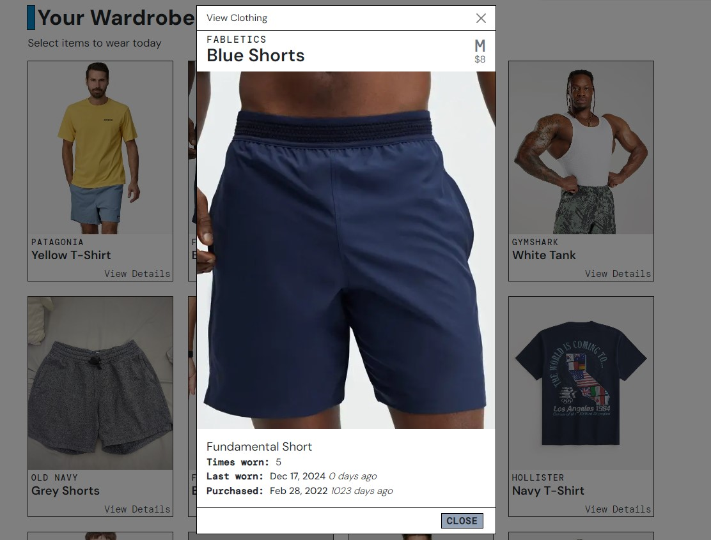

Drobe is currently under construction. 

Drobe is a full-stack web app to virtually store a user's clothing. A user can track what clothing they wear each day. Drobe will highlight
what items a user does not wear. The user can use these suggestions to identify items to donate, optimizing their closet with only their
favorite items.

The app is built on a Flask backend. User data is stored in a MySQL database hosted on AWS. It also uses AWS S3 to handle media. The front
end is built on React using next.js

Below are some screenshots of the prototype I am building out.

## Screenshots of prototype

