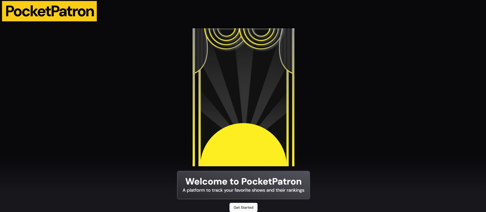
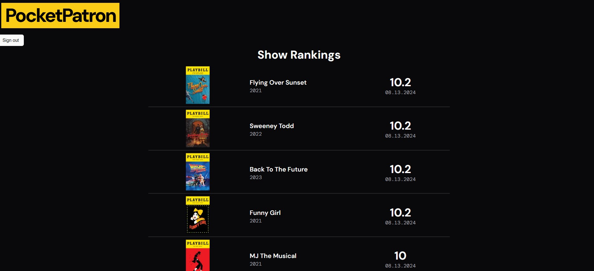
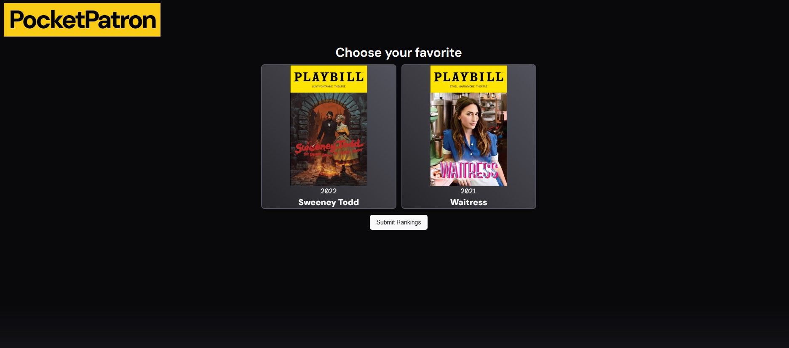

import BlogShareContainer from '../../../components/BlogShareContainer'

<BlogShareContainer github = "https://github.com/benbrill/Pocket-Patron" website = "https://pocket-patron.vercel.app/comparison"/>
PocketPatron is currently in a prototype phase

** visit the prototype of PocketPatron [here](https://pocket-patron.vercel.app/) **

I've always called myself a "Patron of the Arts," but never had any evidence of my patronage.

This new web app, PocketPatron, allows users to document the shows they see and rank them algorithmically. No more racking your brain everytime someone asks which shows you
have seen. Pull out your phone and show them PocketPatron!

The prototype currently allows you to create an account, add shows you've seen, and rank them against each other. The app uses an algorithm that can rank your shows based off of
outcomes of pairwise matchups. Once you have ranked enough shows, a simple ranking list will be generated

Future features will include a diary to detail when, where, and how you saw a specific show, highlights of shows on Broadway, and the ability to view other's top shows.

