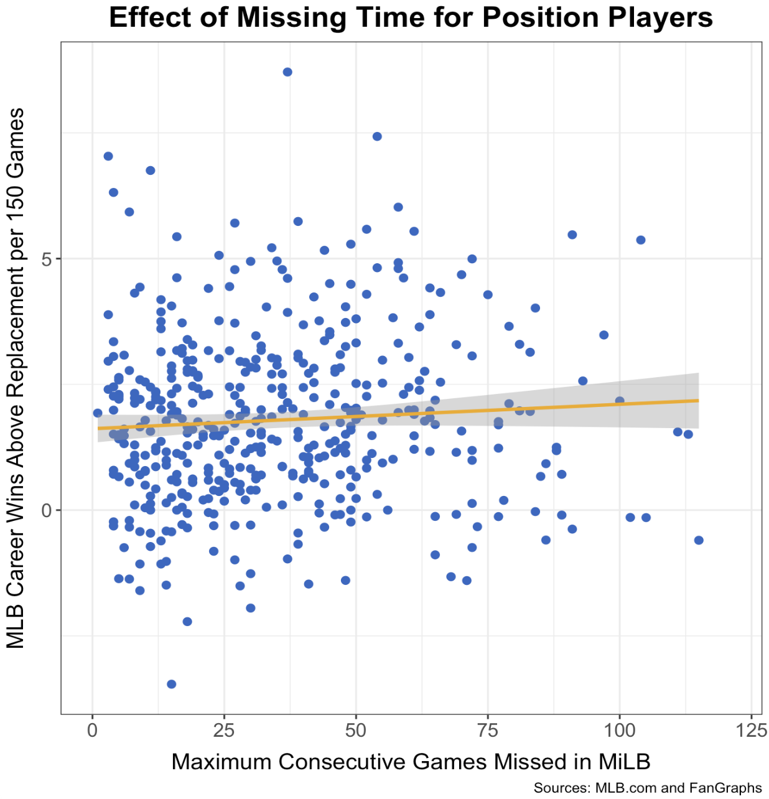
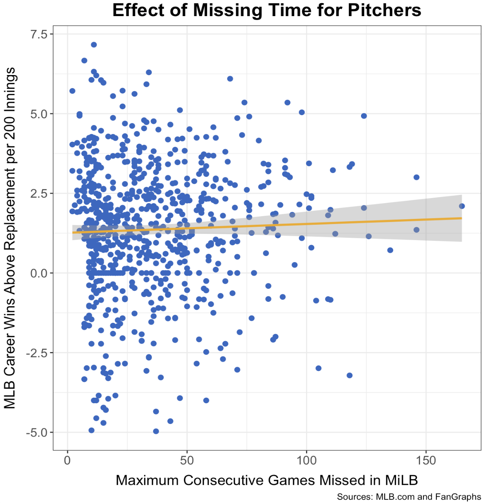
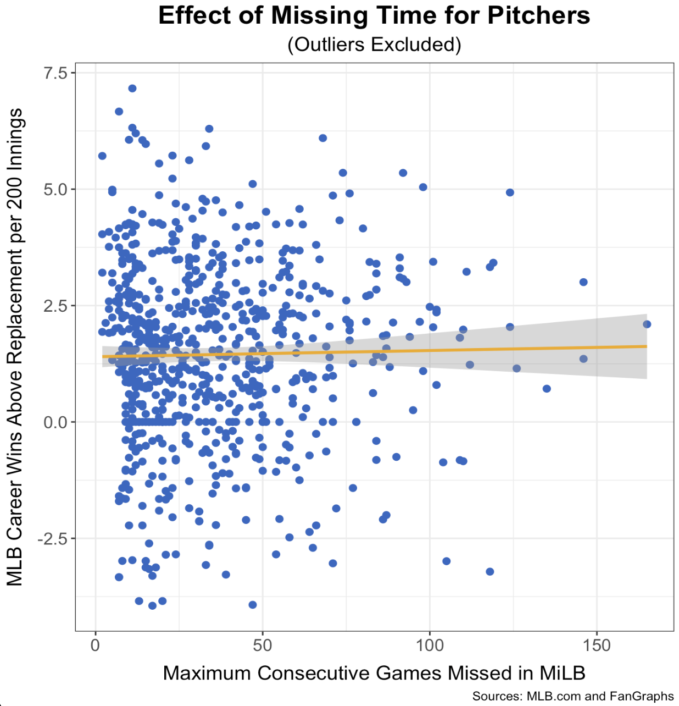

import BlogShareContainer from '../../../components/BlogShareContainer'

<BlogShareContainer  github = "https://github.com/benbrill/STATS-141-Final-Project" attachment = "https://drive.google.com/file/d/1T4LPn0ltTMJZ4ZGkJTxmFTq5PeZOTW4q/view?usp=sharing"/>

## Abstract

Injuries are an unavoidable part of professional baseball at every level. While prevention is an important piece of the injury puzzle, this report focuses on evaluating the effects of missing time while in the Minor Leagues on future Major League performance. To do so, we calculated the largest gap in between two consecutive Minor League games in the same season for every player, and compared it to his career Wins Above Replacement per 150 Major League games played. From there we took a closer look at the types of injury sustained to see if there are certain injury types that front offices might want to stay away from.

## Introduction

In recent years, there has been a growing interest in understanding the factors that influence the performance of professional athletes, particularly those in Major League Baseball. One area of interest is the potential impact of missed playing time during a player's early career in the Minor Leagues on their subsequent performance in the Major Leagues. This project aims to investigate the relationship between the amount of playing time missed in MiLB and a player's later performance in MLB, as measured by FanGraphs’ Wins Above Replacement metric. By analyzing a comprehensive dataset of Minor and Major League game logs from 2013 to 2022, this study seeks to provide valuable insights into whether missed playing time in the early stages of a baseball player's career has a significant effect on their future performance at the highest level of the sport.

## Methodology

### Data Collection 

#### The MLB API
Major League Baseball (MLB) stores data regarding teams, players, venues, stadiums, and games in a RESTful API. The data contained within this API is expansive; not only does it contain data about major league teams, players, and games but it contains similar information about minor, international, and summer leagues. Much of MLB's online interface relies on accessing this API. For instance, if you are on the live feed of the game of your favorite team on mlb.com, the website is making calls to the end points of the API to populate the page with pitch-by-pitch data and player statistics. 

However, since this API was really only designed to be used by mlb.com as well as MLB developers, there is no public documentation for this API. Because of the growing popularity of sports statistics, non-professional data scientists have accumulated and documented the API on their own. In addition, inspecting the elements of a dynamic page making calls to the API can yield insight on how to interact with the API's endpoints. 

To yield data from a RESTful API, one accesses different endpoints by making an HTTP request. In essence, one visits a URL that contains data, usually stored in JSON (Java Script Object Notation) format. All endpoints under the MLB API fall under the base URL of `https://statsapi.mlb.com/api/v1/`. Accessing different types of data from the API is a matter of navigating the subdirectories of this base URL.

#### Getting Data on Players

In order to build a data set on players' minor and major league game logs to evaluate the effect of missing minor league time on major league performance, we first need to establish a pool of players to obtain data on. Initially, we decided to obtain data on players who played on a major league team during the 2022 season who were on a non-minor league contract. 

The MLB API allows us to access data on players rostered by an MLB team by accessing the endpoint `https://statsapi.mlb.com/api/v1/teams/{team}/roster` where `{team}` is the `teamID` as defined by MLB of the team. Accessing this endpoint returns data of each rostered player's name, age, position, and contract type. If players were traded or switched teams during the season, this endpoint returns the team that they were on at the end of the 2022 MLB season. Approximately 1,400 players fit our criteria. Of these players, about 800 were pitchers and around 600 were position players (non-pitchers). 

#### Getting Player's Game Logs

Now that we know which players we want to obtain game logs for, we can go about getting data on the games that these players played in the minor leagues, so we can calculate how much playing time they missed while in the minors. We also wished to obtain basic statistics (average, on base percentage, OPS for hitters) on a game-by-game basis to compare their performance in the minor leagues as well. 

To access a given player's minor league game logs for a given season, we can make a request to the end point `https://statsapi.mlb.com/api/v1/people/{player}/stats?stats|\\=gameLog&gameType=R&leagueListId=milb_all&group=hitting&hydrate=team(league)&language=en&season={season}` where `player` is the `playerPk` or Player ID of the player as defined by the MLB and `season` is the season for which we wish to obtain game logs for. We also can specify the `group` of statistics we want, such as hitting, pitching, or fielding data. For position players, we will get hitting data and for pitchers we will get pitching data.

In order to build the data set, we iterated through the range of the 2015 season to the 2022 season. Within this iteration, we performed an additional search of each player contained within our player pool described above. This $O(n^2)$ process took about 25 minutes to complete for position players. The resulting data set contained around 140,000 rows, where each row represents each minor league game that each unique player played in. The code to generate this data can be found on this !(https://github.com/benbrill/STATS-141-Final-Project/blob/main/scraping.py)[Github page].

#### Getting Injury Data

In order to gain a more comprehensive view of a player's missed time, we also wished to obtain MLB and MiLB transaction logs to view transactions involving the injured list. With these transactions, we can see the specific injury that prompted the player to enter the injured list and subsequently miss time. 

To do this, we accessed the endpoint `https://statsapi.mlb.com/api/v1/transactions?` `playerId={player}`, which contains a record of a baseball player's transactions, including injured list, promotions, demotions, free agent signings, and trades. Data on injured list transactions contain a string field of a description stating which type of injured list the player is entering (10-day, 60-day) as well as the specific injury that prompted this transaction. It is important to note that not all injured list transactions have the specific injury included. Using regular expressions, we extracted the type of injury from the description string and made it into a column in the final injury dataframe.

### Data Cleaning
For our analysis we split all of the 2022 Major League players into two main data sets: position players and pitchers. To create these data sets, we combined all of the Major and Minor League games played from 2013-2022 for all of the 2022 Major League players. This resulted in two data sets with over 600,000 rows where each row represented a singular game played by a player, corresponding game information (league, opponent, game date, game ID), and player performance statistics for that specific game. In order to gain a better understanding of each players performance and their time missed over multiple seasons, we grouped the data by player name. This grouping allowed us to create a new data frame where each row represents one player, number of games played in the Minor League, and the maximum time missed in singular season in the Minor Leagues. After performing the grouping, we created our final final data sets by combining our data frames with each unique player's career Major League performance statistics from 2013-2022. This resulted in a position players data frame with 683 unique players/rows and 21 variables. The pitcher data set contains 800 unique pitchers and 29 variables.

#### Calculating maximum time missed in the Minor Leagues
The first variable we created was maximum time missed for each unique player in a singular Minor League season from 2013-2022. To create this variable, we first subtracted the dates of the consecutive minor league games played for each player in each season. This provided us the number of days in between each player appearance per season in the minors. Then, for each unique player we took the maximum of this value to determine the largest gap of missed time for each player in the Minor Leagues. Lastly, to ensure that the maximum time missed in the Minor League season was not due to an MLB call up, we had our code look at the next game played by a player and ensure it did not take place in the Major League.

#### Standardizing Wins Above Replacement (WAR)
The next variable we created was a standardized version of FanGraphs' Wins Above Replacement (WAR) statistic to serve as our Major League performance measure. As is, WAR quantifies a player's overall value by measuring how many more wins he's worth than a replacement-level player at his same position. This statistic is a very good indicator of player performance. However, it is a cumulative statistic meaning it will generally increase with each additional game played. To combat this, we standardized WAR for position players by dividing it by appearances, and multiplying by 150, to come up with WAR per 150 games played. For pitchers, we standardized WAR by dividing by innings and multiplying by 200 to get WAR per 200 innings.

| `name`          | `team` | `max_days_btwn_games` | ... | `WAR` | WAR/200 IP |
|-----------------|--------|-----------------------|-----|-------|------------|
| Clayton Kershaw | LAD    | 68                    | ... | 49.9  | 6.1        |

#### Classifying different types of injuries

The injuries extracted from the description of injured list transactions as mentioned above were not standardized. Injury descriptions varied in specificity and format. For instance, a hamstring injury could have been classified as a "right hamstring injury" or "Right Hamstring injury" or "Leg contusion, right hamstring." To further classify and standardized these injuries, we manually coded different classifications for each unique injury description. For pitchers, we classified the 74 unique injury descriptions into groupings of hand, arm, lower body, back, upper body, shoulder, and elbow injuries. For position players, we classified the 77 unique injury descriptions into groupings of hip, elbow, lower leg, back, hand, upper leg, knee, shoulder, foot, head, and arm. We then used these groupings to perform analysis.

In addition, we narrowed down the injury data to only include injured list transactions that would have occurred when a player missed the maximum number of times in the minor leagues (as explained above).

## Findings

### Position Players

*Figure 1: A scatter plot showing the relationship between missing consecutive games while in the Minor Leagues and career Major League production for position players who played in MLB in 2022.*

As seen in figure 1, we found that the maximum amount of consecutive games a Minor League position player misses has very little effect, negative or positive, on his Major League career. The relationship between these two led to an $R^2$ of 0.155, meaning if anything, missing developmental time has a positive effect on future production. However, as talked extensively about in the Limitations section, there are a number of confounding variables in this research. For example, not all injuries are the same. That's where Figure 2 comes in to play.

*Figure 2: The average career WAR/150 games grouped by the type of injury a position player sustained. (Arm indicates an injury to the bicep, tricep, or forearm. Hand includes wrist injuries.)*

We categorized each injury we had a report for by the injured body part and averaged the career WAR/150 for every player in each bucket. Towards the right side of the bar chart are the body parts that generally are associated with longer recovery times and more detrimental effect on playing ability, like broken hands, knee surgeries, and general arm injuries. Similar to the overall research question, there is no way for us to control for a player's base level talent when bucketing him in an injury bucket. It is very likely that some injuries will have a more-lasting impact on a career than others but simply looking at a bar chart like this one will not tell the whole story. For example, if Mike Trout (the data set leader in WAR/150 at 8.7) were to have sustained an arm injury, the Arm injury bucket jumps from last place with 1.60 WAR/150, to sixth at 2.08 wins. So while the injury buckets can help understand what injuries have worse impacts than others, at the general level, they will not be career-defining. With more specific injury data, in a larger sample, it is possible to connect more dots regarding what injuries could be career-ending or even career-jump starting in some cases.

### Pitchers

*Figure 3: A scatter plot showing the relationship between missing consecutive games while in the Minor Leagues and career Major League production for pitchers who pitched in MLB in 2022.*

There is even a smaller level of variation explained by missed games on the pitcher side of things. With an $R^2$ of 0.038 there is really no conclusion that can be drawn from this data set. Figure 3 shows the relationship, a very weak one, between time missed and MLB performance, measured by WAR accumulated per 200 innings pitched.

*Figure 4: A scatter plot showing the relationship between missing consecutive games while in the Minor Leagues and career Major League production for pitchers who pitched in MLB in 2022. (The excluded outliers are pitchers who have fewer than 10 innings pitched and/or a career WAR/200 IP outside of -4 to 7.5.)*

As seen in Figure 3, there are some outliers that could be influencing our findings. We recreated that plot but removed pitchers who had thrown fewer than 10 Major League innings and also pitchers whose career WAR/200 innings pitched was lower than -4 or greater than 7.5 because these extremes are often due to a very small sample size. This $R^2$ increased a little bit, to 0.046; but as seen in Figure 4, there is still nothing significant.

*Figure 5: The average WAR/200 innings pitched grouped by the type of injury a pitcher sustained. (Arm indicates an injury to the bicep, tricep, or forearm. Hand includes wrist injuries.)*

Similar to the position players, we divided the injuries by affected body part, as shown in Figure 5. As expected, the Shoulder and Elbow buckets are at the very bottom in terms of career MLB production. Since the labrum in the shoulder and the ulnar collateral ligament in the elbow are common areas for pitchers to tear and require extensive treatment and recovery, they can often derail a pitcher's career. Similarly to the position players' buckets though, these buckets are subject to a lot of other variation and there are many confounding variables to consider.

## Conclusions

### Limitations and Future Directions

Working with baseball data, especially injuries, is subject to a lot of nuance. The most efficient way to calculate the gaps in games played was simply subtract the days between two games and take the maximum for each player. However, this method can lead to losing some key information. For example, a player who missed the end of his team's season one year – since we were only looking at game's missed in the same season – would not turn up with having missed as much time as he did, rather only the maximum he missed prior to the injury. Without any way to account for situations like this automatically, some injury history is lost. Similarly, if a player was injured after the season and could not participate in any off-season training, but was healthy at the end and beginning of the surrounding seasons, his missed time would not be considered. 

Since no MiLB games were played, if a player missed the end of the 2019 season and would have also missed the beginning of the 2020 season, had it been played, that missed time is also unaccounted for.
The last injury-related issue we ran into was regarding a player's injury history. The same injury, or the same amount of missed time, for a first-time offender will likely not have the same affect on their future as someone who is missing extensive time for the fifth or sixth time in his career. But since we were looking at the maximum number of consecutive games missed once in a Minor League career, players who missed substantial time multiple times were not penalized.

If we had more access to Minor League data and Major League projections, we could have made a model with inputs such as missed time, prospect ranking (whether that be based off draft position or signing bonus value or some other metrics), Minor League production, and Major League projections (for example, player was projected to be an X-win player in MLB). More variables like this would allow for us to compare different groups of players against a control group and isolate the true effect of missed time. As it currently stands, it is hard to tell whether a player's Major League production was because of their raw skill, or if the amount of games they missed in the Minors played a major role in their big league career. Along similar lines of trying to isolate true effects, it is possible a player's development in the Minor Leagues was stymied or expedited because of the organization he was in and not the status of his health. For example, teams like the Los Angeles Dodgers and Tampa Bay Rays are widely regarded as having the best player development systems in the league while franchises like the Kansas City Royals and Colorado Rockies are on the other end of the spectrum.