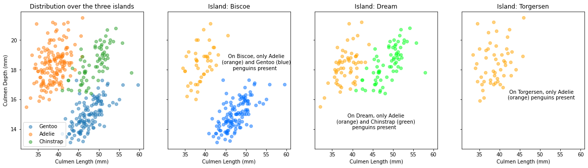
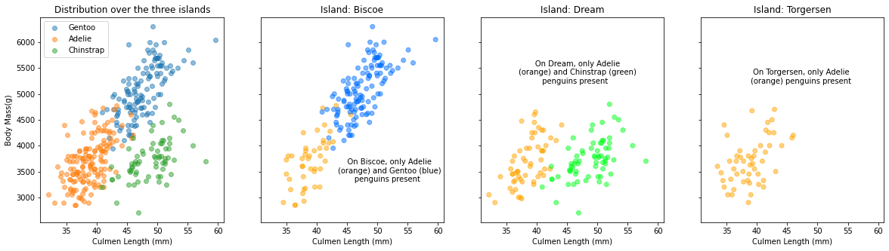
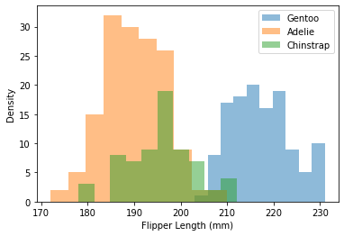
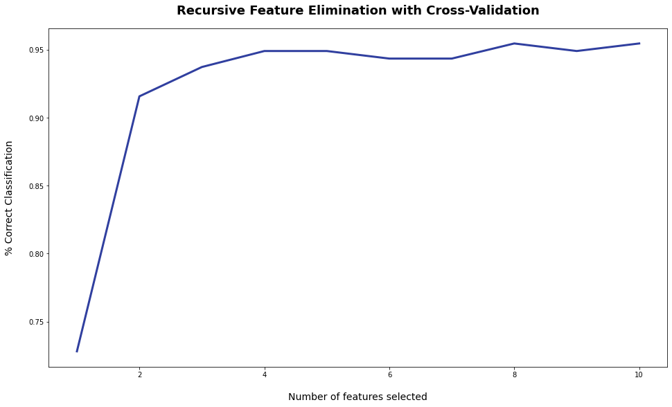
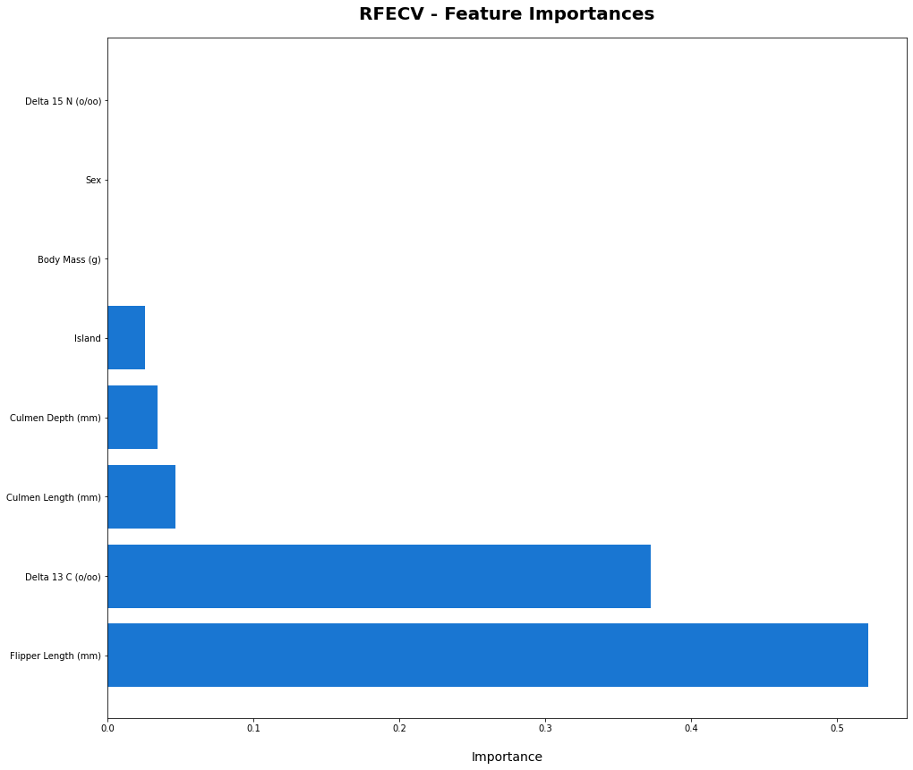
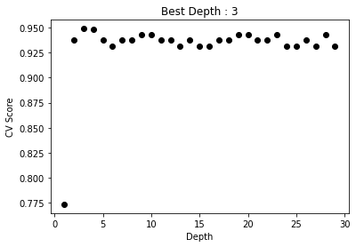
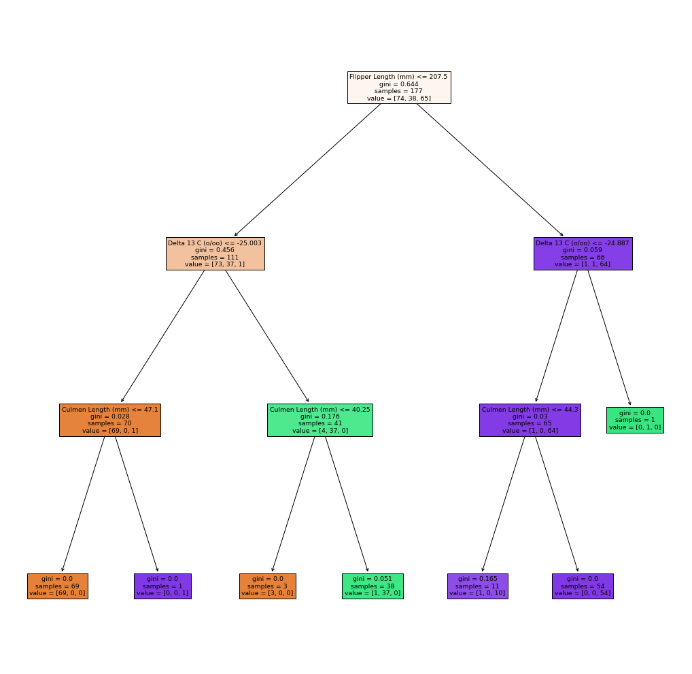
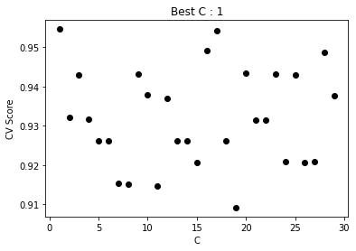
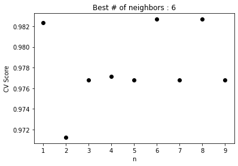
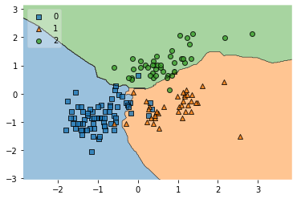

## Group Contributions:

Krishna did the exploratory analyses while Ally did the feature selection section. Ally also created the Decision Tree Classifier model and analyzed those results. Ben created the Logistic Regression and K Nearest Neighbors models and analyzed those results, and wrote the conclusion. We all contributed to discussion in the sections we didn't specifically lead as well. 

Okay, let's get started!


```
#import needed libraries
from matplotlib import pyplot as plt
import pandas as pd
import numpy as np
import urllib
```


```
#get our data
penguins = pd.read_csv("https://raw.githubusercontent.com/PhilChodrow/PIC16A/master/datasets/palmer_penguins.csv")
penguins["Species"] = penguins["Species"].str.split().str.get(0)
cols = ["Species","Region","Island", "Culmen Length (mm)", "Culmen Depth (mm)", "Flipper Length (mm)", "Body Mass (g)", "Sex", "Delta 15 N (o/oo)", "Delta 13 C (o/oo)"]
penguins[cols]
```


<div>
<table border="1" class="dataframe">
  <thead>
    <tr style="text-align: right;">
      <th></th>
      <th>Species</th>
      <th>Region</th>
      <th>Island</th>
      <th>Culmen Length (mm)</th>
      <th>Culmen Depth (mm)</th>
      <th>Flipper Length (mm)</th>
      <th>Body Mass (g)</th>
      <th>Sex</th>
      <th>Delta 15 N (o/oo)</th>
      <th>Delta 13 C (o/oo)</th>
    </tr>
  </thead>
  <tbody>
    <tr>
      <th>0</th>
      <td>Adelie</td>
      <td>Anvers</td>
      <td>Torgersen</td>
      <td>39.1</td>
      <td>18.7</td>
      <td>181.0</td>
      <td>3750.0</td>
      <td>MALE</td>
      <td>NaN</td>
      <td>NaN</td>
    </tr>
    <tr>
      <th>1</th>
      <td>Adelie</td>
      <td>Anvers</td>
      <td>Torgersen</td>
      <td>39.5</td>
      <td>17.4</td>
      <td>186.0</td>
      <td>3800.0</td>
      <td>FEMALE</td>
      <td>8.94956</td>
      <td>-24.69454</td>
    </tr>
    <tr>
      <th>2</th>
      <td>Adelie</td>
      <td>Anvers</td>
      <td>Torgersen</td>
      <td>40.3</td>
      <td>18.0</td>
      <td>195.0</td>
      <td>3250.0</td>
      <td>FEMALE</td>
      <td>8.36821</td>
      <td>-25.33302</td>
    </tr>
    <tr>
      <th>3</th>
      <td>Adelie</td>
      <td>Anvers</td>
      <td>Torgersen</td>
      <td>NaN</td>
      <td>NaN</td>
      <td>NaN</td>
      <td>NaN</td>
      <td>NaN</td>
      <td>NaN</td>
      <td>NaN</td>
    </tr>
    <tr>
      <th>4</th>
      <td>Adelie</td>
      <td>Anvers</td>
      <td>Torgersen</td>
      <td>36.7</td>
      <td>19.3</td>
      <td>193.0</td>
      <td>3450.0</td>
      <td>FEMALE</td>
      <td>8.76651</td>
      <td>-25.32426</td>
    </tr>
    <tr>
      <th>...</th>
      <td>...</td>
      <td>...</td>
      <td>...</td>
      <td>...</td>
      <td>...</td>
      <td>...</td>
      <td>...</td>
      <td>...</td>
      <td>...</td>
      <td>...</td>
    </tr>
    <tr>
      <th>339</th>
      <td>Gentoo</td>
      <td>Anvers</td>
      <td>Biscoe</td>
      <td>NaN</td>
      <td>NaN</td>
      <td>NaN</td>
      <td>NaN</td>
      <td>NaN</td>
      <td>NaN</td>
      <td>NaN</td>
    </tr>
    <tr>
      <th>340</th>
      <td>Gentoo</td>
      <td>Anvers</td>
      <td>Biscoe</td>
      <td>46.8</td>
      <td>14.3</td>
      <td>215.0</td>
      <td>4850.0</td>
      <td>FEMALE</td>
      <td>8.41151</td>
      <td>-26.13832</td>
    </tr>
    <tr>
      <th>341</th>
      <td>Gentoo</td>
      <td>Anvers</td>
      <td>Biscoe</td>
      <td>50.4</td>
      <td>15.7</td>
      <td>222.0</td>
      <td>5750.0</td>
      <td>MALE</td>
      <td>8.30166</td>
      <td>-26.04117</td>
    </tr>
    <tr>
      <th>342</th>
      <td>Gentoo</td>
      <td>Anvers</td>
      <td>Biscoe</td>
      <td>45.2</td>
      <td>14.8</td>
      <td>212.0</td>
      <td>5200.0</td>
      <td>FEMALE</td>
      <td>8.24246</td>
      <td>-26.11969</td>
    </tr>
    <tr>
      <th>343</th>
      <td>Gentoo</td>
      <td>Anvers</td>
      <td>Biscoe</td>
      <td>49.9</td>
      <td>16.1</td>
      <td>213.0</td>
      <td>5400.0</td>
      <td>MALE</td>
      <td>8.36390</td>
      <td>-26.15531</td>
    </tr>
  </tbody>
</table>
<p>344 rows × 10 columns</p>
</div>


# Exploratory Data Analysis


```
# This will give us a set we can iterate over
species = ["Gentoo", "Adelie", "Chinstrap"]


# The reason we want to share the x-axis is to make the island-specific plots
# look and seem to have the same scale as the axis for the first plot
fig, ax = plt.subplots(1,4 , figsize = (20,5), sharey = True, sharex =True)
ax[0].set(ylabel = "Culmen Depth (mm)",
          xlabel = "Culmen Length (mm)")


for i in species:
    x = penguins[penguins["Species"] == i]["Culmen Length (mm)"]
    y = penguins[penguins["Species"] == i]["Culmen Depth (mm)"]
    ax[0].scatter(x,y, label = i, alpha = 0.5)

ax[0].legend()
ax[0].set(title = "Distribution over the three islands")

# making a copy to avoid modifying raw data
penguins2 = penguins.copy()

from sklearn import preprocessing
le = preprocessing.LabelEncoder()
# Convert penguin species to 0, 1, 2 for Adelie, Chinstrap and Gentoo respectively, for mapping colors
# to species in our axes
penguins2['Species'] = le.fit_transform(penguins2['Species'])

islands = ["Biscoe", "Dream", "Torgersen"]

# We iterate over the islands, making a scatterplot for each one
for i in islands:
    ax[islands.index(i) + 1].scatter(penguins2[penguins2["Island"] == i]['Culmen Length (mm)'],
                                     penguins2[penguins2["Island"] == i]['Culmen Depth (mm)'],
                                     c = (penguins2[penguins2["Island"] == i]['Species']) + 0.95,
                                     cmap = "gist_rainbow", vmin = 0.4, vmax = 4.1, alpha = 0.5)
    
    # We title each of these plots with the island it is in
    ax[islands.index(i) + 1].set(xlabel = "Culmen Length (mm)",
                                 title = "Island: " + str(i))
    
# Adding some text to our graphs just to show which species are present in each island
ax[1].text(44, 18, "    On Biscoe, only Adelie\n(orange) and Gentoo (blue)\n       penguins present")


ax[2].text(36, 14, "       On Dream, only Adelie\n(orange) and Chinstrap (green)\n          penguins present")


ax[3].text(42, 16, " On Torgersen, only Adelie\n(orange) penguins present")
```


    Text(42, 16, ' On Torgersen, only Adelie\n(orange) penguins present')


    

    


> *Figure 1 - Culmen Length (mm) and Culmen Depth (mm)* **SCATTER PLOTS**

This first axis plots Culmen Length (mm) against Culmen Depth (mm), using a legend to differentiate the species. Each species occupies its own cluster within the axis allowing us to get a general idea of the distribution: Gentoo penguins tend to have relatively shallow and long culmens; Chinstrap penguins tend to have have relatively long and deep culmens; Adelie penguins tend to have relatively short and deep culmens.

The other three axes show these distributions but on different islands. As is describes in the axes, different sets of species are present on different islands.

There doesn't seem to be a correlation between Culmen Length and Depth.

> Now, let's dive a little deeper into measurements for Culmen Length (mm) and Culmen Depth (mm)


```
def penguin_summary_table(group_cols, value_cols):
    
    # we will use this function to create informative tables, with the mean values of the columns passed by the
    # user, as arguments of the function
    df = penguins.groupby(group_cols)[value_cols].mean()
    return df.round(2)


penguin_summary_table(["Species"], ["Culmen Length (mm)", "Culmen Depth (mm)"])
```


<div>
<table border="1" class="dataframe">
  <thead>
    <tr style="text-align: right;">
      <th></th>
      <th>Culmen Length (mm)</th>
      <th>Culmen Depth (mm)</th>
    </tr>
    <tr>
      <th>Species</th>
      <th></th>
      <th></th>
    </tr>
  </thead>
  <tbody>
    <tr>
      <th>Adelie</th>
      <td>38.79</td>
      <td>18.35</td>
    </tr>
    <tr>
      <th>Chinstrap</th>
      <td>48.83</td>
      <td>18.42</td>
    </tr>
    <tr>
      <th>Gentoo</th>
      <td>47.50</td>
      <td>14.98</td>
    </tr>
  </tbody>
</table>
</div>


> *Table 1a - Culmen Length (mm) and Culmen Depth (mm)* **SPECIES' MEAN VALUES**

This data confirms what we saw in the graph: 

* Adelie penguins tend to have the shortest Culmens and Chinstrap and Gentoo penguins tend to have similar Culmen lengths (almost 10mm more than the average Adelie penguin). 

* When looking at Culmen Depth, Gentoo penguins tend to have the lowest value. Adelie and Chinstrap penguins have similar values for their Culmen Depth and, on average, their culmens are roughly 3.5mm deeper


```
penguin_summary_table(["Species", "Sex"], ["Culmen Length (mm)", "Culmen Depth (mm)"])
```


<div>
<table border="1" class="dataframe">
  <thead>
    <tr style="text-align: right;">
      <th></th>
      <th></th>
      <th>Culmen Length (mm)</th>
      <th>Culmen Depth (mm)</th>
    </tr>
    <tr>
      <th>Species</th>
      <th>Sex</th>
      <th></th>
      <th></th>
    </tr>
  </thead>
  <tbody>
    <tr>
      <th rowspan="2" valign="top">Adelie</th>
      <th>FEMALE</th>
      <td>37.26</td>
      <td>17.62</td>
    </tr>
    <tr>
      <th>MALE</th>
      <td>40.39</td>
      <td>19.07</td>
    </tr>
    <tr>
      <th rowspan="2" valign="top">Chinstrap</th>
      <th>FEMALE</th>
      <td>46.57</td>
      <td>17.59</td>
    </tr>
    <tr>
      <th>MALE</th>
      <td>51.09</td>
      <td>19.25</td>
    </tr>
    <tr>
      <th rowspan="3" valign="top">Gentoo</th>
      <th>.</th>
      <td>44.50</td>
      <td>15.70</td>
    </tr>
    <tr>
      <th>FEMALE</th>
      <td>45.56</td>
      <td>14.24</td>
    </tr>
    <tr>
      <th>MALE</th>
      <td>49.47</td>
      <td>15.72</td>
    </tr>
  </tbody>
</table>
</div>


> *Table 1b - Culmen Length (mm) and Culmen Depth (mm)* **SPECIES' MEAN VALUES BY SEX**

Here, we just see that there isn't much difference in these measurements between the *males* and *females* of a species. However, on average, the males do have both longer and deeper culmens


```
# The reason we want to share the x-axis is to make the island-specific plots
# look and seem to have the same scale as the axis for the first plot
fig, ax = plt.subplots(1,4 , figsize = (20,5), sharey = True, sharex = True)
ax[0].set(ylabel = "Body Mass(g)",
          xlabel = "Culmen Length (mm)")

# species gave us a set we can iterate over

for i in species:
    x = penguins[penguins["Species"] == i]["Culmen Length (mm)"]
    y = penguins[penguins["Species"] == i]["Body Mass (g)"]
    ax[0].scatter(x,y, label = i, alpha = 0.5)

ax[0].legend()
ax[0].set(title = "Distribution over the three islands")

# making a copy to avoid modifying raw data
penguins2 = penguins.copy()

from sklearn import preprocessing
le = preprocessing.LabelEncoder()
# Convert penguin species to 0, 1, 2 for Adelie, Chinstrap and Gentoo respectively, for mapping colors
# to species in our axes
penguins2['Species'] = le.fit_transform(penguins2['Species'])

islands = ["Biscoe", "Dream", "Torgersen"]

# We iterate over the islands, making a scatterplot for each one
for i in islands:
    ax[islands.index(i) + 1].scatter(penguins2[penguins2["Island"] == i]['Culmen Length (mm)'],
                                     penguins2[penguins2["Island"] == i]['Body Mass (g)'],
                                     c = (penguins2[penguins2["Island"] == i]['Species']) + 0.95,
                                     cmap = "gist_rainbow", vmin = 0.4, vmax = 4.1, alpha = 0.5)
    
    # We title each of these plots with the island it is in
    ax[islands.index(i) + 1].set(xlabel = "Culmen Length (mm)",
                                 title = "Island: " + str(i))
    
# Adding some text to our graphs just to show which species are present in each island
ax[1].text(43.5, 3300, "    On Biscoe, only Adelie\n(orange) and Gentoo (blue)\n       penguins present")


ax[2].text(37, 5200, "       On Dream, only Adelie\n(orange) and Chinstrap (green)\n          penguins present")


ax[3].text(39, 5200, " On Torgersen, only Adelie\n(orange) penguins present")
```


    Text(39, 5200, ' On Torgersen, only Adelie\n(orange) penguins present')


    

    


> *Figure 2 - Culmen Length (mm) and Body Mass (g)* **SCATTER PLOTS**

This first axis plots Culmen Length (mm) against Body Mass (g), using a legend to differentiate the species. Again, each species occupies its own cluster within the axis allowing us to get a general idea of the distribution: Gentoo penguins tend to have relatively long culmens and large body masses; Chinstrap penguins tend to have have relatively long culmens but average body masses (similar to Adelie); Adelie penguins tend to have relatively short culmens and also average body masses.

The other three axes show these distributions but on different islands. As is describes in the axes, different sets of species are present on different islands.

There does seem to be some positive correlation between Culmen Length and Body Mass:

* Gentoo penguins have long culmens and large body masses.
* Adelie penguins have short culmens and relatively smaller body masses


>It could be the case that culmen length and body mass are positively correlated


```
penguin_summary_table(["Species"], ["Culmen Length (mm)", "Body Mass (g)"])
```


<div>
<table border="1" class="dataframe">
  <thead>
    <tr style="text-align: right;">
      <th></th>
      <th>Culmen Length (mm)</th>
      <th>Body Mass (g)</th>
    </tr>
    <tr>
      <th>Species</th>
      <th></th>
      <th></th>
    </tr>
  </thead>
  <tbody>
    <tr>
      <th>Adelie</th>
      <td>38.79</td>
      <td>3700.66</td>
    </tr>
    <tr>
      <th>Chinstrap</th>
      <td>48.83</td>
      <td>3733.09</td>
    </tr>
    <tr>
      <th>Gentoo</th>
      <td>47.50</td>
      <td>5076.02</td>
    </tr>
  </tbody>
</table>
</div>


> *Table 2a - Culmen Length (mm) and Body Mass (g)* **SPECIES' MEAN VALUES**

This data confirms what we saw in the graph: 

* Adelie penguins tend to have the shortest Culmens and Chinstrap and Gentoo penguins tend to have similar Culmen lengths (almost 10mm more than the average Adelie penguin). 

* When looking at body mass, Gentoo penguins tend to have significantly higher values. Just as we saw with culmen depthAdelie and Chinstrap penguins have similar values for their body mass. However, this time, their value is significantly *lower* than the body mass for Gentoo penguins. Gentoo penguins tend to have masses almost 1.5 kg higher.


```
penguin_summary_table(["Species", "Sex"], ["Culmen Length (mm)", "Body Mass (g)"])
```


<div>
<table border="1" class="dataframe">
  <thead>
    <tr style="text-align: right;">
      <th></th>
      <th></th>
      <th>Culmen Length (mm)</th>
      <th>Body Mass (g)</th>
    </tr>
    <tr>
      <th>Species</th>
      <th>Sex</th>
      <th></th>
      <th></th>
    </tr>
  </thead>
  <tbody>
    <tr>
      <th rowspan="2" valign="top">Adelie</th>
      <th>FEMALE</th>
      <td>37.26</td>
      <td>3368.84</td>
    </tr>
    <tr>
      <th>MALE</th>
      <td>40.39</td>
      <td>4043.49</td>
    </tr>
    <tr>
      <th rowspan="2" valign="top">Chinstrap</th>
      <th>FEMALE</th>
      <td>46.57</td>
      <td>3527.21</td>
    </tr>
    <tr>
      <th>MALE</th>
      <td>51.09</td>
      <td>3938.97</td>
    </tr>
    <tr>
      <th rowspan="3" valign="top">Gentoo</th>
      <th>.</th>
      <td>44.50</td>
      <td>4875.00</td>
    </tr>
    <tr>
      <th>FEMALE</th>
      <td>45.56</td>
      <td>4679.74</td>
    </tr>
    <tr>
      <th>MALE</th>
      <td>49.47</td>
      <td>5484.84</td>
    </tr>
  </tbody>
</table>
</div>


> *Table 2b - Culmen Length (mm) and Body Mass (g)* **SPECIES' MEAN VALUES BY SEX**

Here, we just see that there isn't much difference in these measurements between the *males* and *females* of a species *for culmen length*. However, males do have **significantly higher body masses than females** for all three species (males have a 10-20% higher body mass depending on the species). 

On average, the males do have both longer and deeper culmens.


```
fig, ax = plt.subplots(1)

# Remember, species was just the list of the three species - ["Gentoo", "Adelie", "Chinstrap"]
for i in species:
  x = penguins[penguins["Species"] == i]["Flipper Length (mm)"] 
  x = x[x.notnull()]
  ax.hist(x, label = i, alpha = 0.5)

  
ax.set(xlabel = "Flipper Length (mm)", ylabel = "Density")
ax.legend()
```


    <matplotlib.legend.Legend at 0x7f9d160f2978>


    

    


> *Figure 3 - Flipper Length (mm)* **HISTOGRAM**

We have looked at the comparisons of Culmen Length(mm), Culmen Depth(mm) and Body Mass (g). Now, let's focus on a different measurement, Flipper Length (mm):

* Most Adelie penguins are shown to have shorter flippers, with the maximum densities of Adelie penguins focused around the 183-187 mm region.
* Chinstrap penguins seem to tend to have flippers that are a little longer - the maximum densities of Chinstrap penguins have a flipper length of around 195-200 mm.
* Gentoo penguins have significantly longer flippers, with the maximum densities hovering around the 210 to 220 mm region.


```
penguins.drop("Sample Number", axis = 1).groupby(["Species", "Island", "Sex"]).mean()
```


<div>
<table border="1" class="dataframe">
  <thead>
    <tr style="text-align: right;">
      <th></th>
      <th></th>
      <th></th>
      <th>Culmen Length (mm)</th>
      <th>Culmen Depth (mm)</th>
      <th>Flipper Length (mm)</th>
      <th>Body Mass (g)</th>
      <th>Delta 15 N (o/oo)</th>
      <th>Delta 13 C (o/oo)</th>
    </tr>
    <tr>
      <th>Species</th>
      <th>Island</th>
      <th>Sex</th>
      <th></th>
      <th></th>
      <th></th>
      <th></th>
      <th></th>
      <th></th>
    </tr>
  </thead>
  <tbody>
    <tr>
      <th rowspan="6" valign="top">Adelie</th>
      <th rowspan="2" valign="top">Biscoe</th>
      <th>FEMALE</th>
      <td>37.359091</td>
      <td>17.704545</td>
      <td>187.181818</td>
      <td>3369.318182</td>
      <td>8.774242</td>
      <td>-25.920176</td>
    </tr>
    <tr>
      <th>MALE</th>
      <td>40.590909</td>
      <td>19.036364</td>
      <td>190.409091</td>
      <td>4050.000000</td>
      <td>8.872945</td>
      <td>-25.917227</td>
    </tr>
    <tr>
      <th rowspan="2" valign="top">Dream</th>
      <th>FEMALE</th>
      <td>36.911111</td>
      <td>17.618519</td>
      <td>187.851852</td>
      <td>3344.444444</td>
      <td>8.914803</td>
      <td>-25.736636</td>
    </tr>
    <tr>
      <th>MALE</th>
      <td>40.071429</td>
      <td>18.839286</td>
      <td>191.928571</td>
      <td>4045.535714</td>
      <td>8.984427</td>
      <td>-25.759120</td>
    </tr>
    <tr>
      <th rowspan="2" valign="top">Torgersen</th>
      <th>FEMALE</th>
      <td>37.554167</td>
      <td>17.550000</td>
      <td>188.291667</td>
      <td>3395.833333</td>
      <td>8.663160</td>
      <td>-25.738735</td>
    </tr>
    <tr>
      <th>MALE</th>
      <td>40.586957</td>
      <td>19.391304</td>
      <td>194.913043</td>
      <td>4034.782609</td>
      <td>8.919919</td>
      <td>-25.835347</td>
    </tr>
    <tr>
      <th rowspan="2" valign="top">Chinstrap</th>
      <th rowspan="2" valign="top">Dream</th>
      <th>FEMALE</th>
      <td>46.573529</td>
      <td>17.588235</td>
      <td>191.735294</td>
      <td>3527.205882</td>
      <td>9.250962</td>
      <td>-24.565405</td>
    </tr>
    <tr>
      <th>MALE</th>
      <td>51.094118</td>
      <td>19.252941</td>
      <td>199.911765</td>
      <td>3938.970588</td>
      <td>9.464535</td>
      <td>-24.527679</td>
    </tr>
    <tr>
      <th rowspan="3" valign="top">Gentoo</th>
      <th rowspan="3" valign="top">Biscoe</th>
      <th>.</th>
      <td>44.500000</td>
      <td>15.700000</td>
      <td>217.000000</td>
      <td>4875.000000</td>
      <td>8.041110</td>
      <td>-26.184440</td>
    </tr>
    <tr>
      <th>FEMALE</th>
      <td>45.563793</td>
      <td>14.237931</td>
      <td>212.706897</td>
      <td>4679.741379</td>
      <td>8.193405</td>
      <td>-26.197205</td>
    </tr>
    <tr>
      <th>MALE</th>
      <td>49.473770</td>
      <td>15.718033</td>
      <td>221.540984</td>
      <td>5484.836066</td>
      <td>8.303429</td>
      <td>-26.170608</td>
    </tr>
  </tbody>
</table>
</div>


> Table 3 - **OVERVIEW**

This table has mean values, by species and sex, for most of the variables in the dataset

# Choosing our features - a start on modeling


First we split the data into training and testing data to use for our three models. Before running our models, we want to figure out which features to use to get the most accurate results. To do so, we are going to use the training data for automated feature selection. 


```
from sklearn.model_selection import train_test_split
np.random.seed(1000) #keeps results constant
copy = penguins #making a copy of penguins df to not edit original df
copy = copy[copy['Sex'].notna()] #removes rows with NaN value in sex column
train, test = train_test_split(copy, test_size = 0.45) #random 65% of rows go into train, other 35% into test
```

Now that we've split the data into training and testing, we first need to clean it up a little bit before figuring out what columns to use for our models.


```
from sklearn import preprocessing

def clean_data(data): 
  '''
  Cleans data from penguins df by turning qualitative items into
  numbered data in a new copy of the penguins data frame.
  These changes are applied to the training and test sets.

  Additionally, the data will be split into target and predictor dataframes. 
  '''
  df = data.copy()
  le = preprocessing.LabelEncoder()
  
  #changing qualitative columns into quantitative
  df["Species"] = le.fit_transform(df["Species"])
  df["Clutch Completion"] = le.fit_transform(df["Clutch Completion"])
  df["Region"] = le.fit_transform(df["Region"])
  df["Island"] = le.fit_transform(df["Island"])
  df["Sex"] = le.fit_transform(df["Sex"])

  #dropping all features that obviously do not relate to the species type
  df = df.drop(["Comments", "Individual ID", "Sample Number", "studyName", "Date Egg", "Stage"], axis = 1)
  
  df = df.dropna()

  #target data
  X = df.drop(["Species"], axis = 1)
  #predictor data
  y = df["Species"]
  return (X,y)
```


```
X_train, y_train = clean_data(train)
X_test, y_test = clean_data(test)
```

Observe that now we have ```X_train```, which is the training data (without the species column), now with only quantitative values and excluding features that do not relate to the species type. ```y_train``` now includes only the Species column, and has values of 0-2 to represent the three species.


```
X_train
```


<div>
<table border="1" class="dataframe">
  <thead>
    <tr style="text-align: right;">
      <th></th>
      <th>Region</th>
      <th>Island</th>
      <th>Clutch Completion</th>
      <th>Culmen Length (mm)</th>
      <th>Culmen Depth (mm)</th>
      <th>Flipper Length (mm)</th>
      <th>Body Mass (g)</th>
      <th>Sex</th>
      <th>Delta 15 N (o/oo)</th>
      <th>Delta 13 C (o/oo)</th>
    </tr>
  </thead>
  <tbody>
    <tr>
      <th>267</th>
      <td>0</td>
      <td>0</td>
      <td>0</td>
      <td>50.5</td>
      <td>15.9</td>
      <td>225.0</td>
      <td>5400.0</td>
      <td>2</td>
      <td>8.65803</td>
      <td>-26.57585</td>
    </tr>
    <tr>
      <th>179</th>
      <td>0</td>
      <td>1</td>
      <td>0</td>
      <td>49.5</td>
      <td>19.0</td>
      <td>200.0</td>
      <td>3800.0</td>
      <td>2</td>
      <td>9.63074</td>
      <td>-24.34684</td>
    </tr>
    <tr>
      <th>89</th>
      <td>0</td>
      <td>1</td>
      <td>1</td>
      <td>38.9</td>
      <td>18.8</td>
      <td>190.0</td>
      <td>3600.0</td>
      <td>1</td>
      <td>8.36936</td>
      <td>-26.11199</td>
    </tr>
    <tr>
      <th>293</th>
      <td>0</td>
      <td>0</td>
      <td>1</td>
      <td>46.5</td>
      <td>14.8</td>
      <td>217.0</td>
      <td>5200.0</td>
      <td>1</td>
      <td>8.58487</td>
      <td>-26.59290</td>
    </tr>
    <tr>
      <th>63</th>
      <td>0</td>
      <td>0</td>
      <td>1</td>
      <td>41.1</td>
      <td>18.2</td>
      <td>192.0</td>
      <td>4050.0</td>
      <td>2</td>
      <td>8.62264</td>
      <td>-26.60023</td>
    </tr>
    <tr>
      <th>...</th>
      <td>...</td>
      <td>...</td>
      <td>...</td>
      <td>...</td>
      <td>...</td>
      <td>...</td>
      <td>...</td>
      <td>...</td>
      <td>...</td>
      <td>...</td>
    </tr>
    <tr>
      <th>264</th>
      <td>0</td>
      <td>0</td>
      <td>1</td>
      <td>50.5</td>
      <td>15.9</td>
      <td>222.0</td>
      <td>5550.0</td>
      <td>2</td>
      <td>8.46894</td>
      <td>-26.60436</td>
    </tr>
    <tr>
      <th>258</th>
      <td>0</td>
      <td>0</td>
      <td>1</td>
      <td>44.0</td>
      <td>13.6</td>
      <td>208.0</td>
      <td>4350.0</td>
      <td>1</td>
      <td>8.01979</td>
      <td>-26.68311</td>
    </tr>
    <tr>
      <th>198</th>
      <td>0</td>
      <td>1</td>
      <td>1</td>
      <td>50.1</td>
      <td>17.9</td>
      <td>190.0</td>
      <td>3400.0</td>
      <td>1</td>
      <td>9.46819</td>
      <td>-24.45721</td>
    </tr>
    <tr>
      <th>77</th>
      <td>0</td>
      <td>2</td>
      <td>1</td>
      <td>37.2</td>
      <td>19.4</td>
      <td>184.0</td>
      <td>3900.0</td>
      <td>2</td>
      <td>8.35540</td>
      <td>-26.44787</td>
    </tr>
    <tr>
      <th>93</th>
      <td>0</td>
      <td>1</td>
      <td>1</td>
      <td>39.6</td>
      <td>18.1</td>
      <td>186.0</td>
      <td>4450.0</td>
      <td>2</td>
      <td>8.49915</td>
      <td>-26.42406</td>
    </tr>
  </tbody>
</table>
<p>177 rows × 10 columns</p>
</div>


Onto the fun stuff. Now that we have our data cleaned, we can use Automated Feature Selection to choose the most important columns to use, based on the training data.

This code essentially removes the least important feature one at a time until the three most important remain.


```
from sklearn.datasets import make_classification
from sklearn.feature_selection import RFE
from sklearn.tree import DecisionTreeClassifier

# define RFE - get to 3 features(columns)
rfe = RFE(estimator = DecisionTreeClassifier(), n_features_to_select=3, step = 1)
rfe.fit(X_train, y_train)

# figure out best features
selector = rfe.fit(X_train, y_train)
selector.support_, selector.ranking_
```


    (array([False, False, False,  True, False,  True, False, False, False,
             True]), array([8, 3, 7, 1, 5, 1, 6, 4, 2, 1]))


It looks like by using Recursive Feature Elimination, our most important columns are ```Culmen Length (mm)```, ```Flipper Length (mm)```, and ```Delta 13 C o/oo``` based on the randomly chosen 80% of the penguins dataset.

Let's look at this more in depth, using recursive feature elimination with cross validation to visualize the importance of each feature. Unlike RFE, RFECV uses cross validation and finds the optimal number of features to use, rather than the number of features specified by the user:


```
from sklearn.feature_selection import RFECV
from sklearn.model_selection import StratifiedKFold

# define RFECV with 10 folds
rfecv = RFECV(estimator = DecisionTreeClassifier(), step=1, cv=StratifiedKFold(10), scoring='accuracy')
rfecv.fit(X_train, y_train)
```


    RFECV(cv=StratifiedKFold(n_splits=10, random_state=None, shuffle=False),
          estimator=DecisionTreeClassifier(ccp_alpha=0.0, class_weight=None,
                                           criterion='gini', max_depth=None,
                                           max_features=None, max_leaf_nodes=None,
                                           min_impurity_decrease=0.0,
                                           min_impurity_split=None,
                                           min_samples_leaf=1, min_samples_split=2,
                                           min_weight_fraction_leaf=0.0,
                                           presort='deprecated', random_state=None,
                                           splitter='best'),
          min_features_to_select=1, n_jobs=None, scoring='accuracy', step=1,
          verbose=0)


We did not write the code below, but found it useful for visualization. The code comes from https://towardsdatascience.com/feature-selection-in-python-recursive-feature-elimination-19f1c39b8d15


```
print('Optimal number of features: {}'.format(rfecv.n_features_))

#plots % correct classification for each number of features used
plt.figure(figsize=(16, 9))
plt.title('Recursive Feature Elimination with Cross-Validation', fontsize=18, fontweight='bold', pad=20)
plt.xlabel('Number of features selected', fontsize=14, labelpad=20)
plt.ylabel('% Correct Classification', fontsize=14, labelpad=20)
plt.plot(range(1, len(rfecv.grid_scores_) + 1), rfecv.grid_scores_, color='#303F9F', linewidth=3)

plt.show()
```

    Optimal number of features: 8
    


    

    


From the above graph, we can see that using three features does not give us the best percentage of corrected classification, but it's in the 90's which is great. If we wanted the most accurate model, we could use 8 features, but the model wouldn't do as well when given less data to use to predict the species.

Here the code is removing the features that are least important. We can see that columns 0 (Region) and 1 (Island) are being dropped. 


```
print(np.where(rfecv.support_ == False)[0])
X_train.drop(X_train.columns[np.where(rfecv.support_ == False)[0]], axis=1, inplace=True)
```

    [0 2]
    

Below is a feature importance bar graph that represents the importance of each feature in determining species. Again, this code is from the source listed above, modified for our data.


```
dset = pd.DataFrame()
dset['attr'] = X_train.columns
dset['importance'] = rfecv.estimator_.feature_importances_

dset = dset.sort_values(by='importance', ascending=False)

plt.figure(figsize=(16, 14))
plt.barh(y=dset['attr'], width=dset['importance'], color='#1976D2')
plt.title('RFECV - Feature Importances', fontsize=20, fontweight='bold', pad=20)
plt.xlabel('Importance', fontsize=14, labelpad=20)
plt.show()
```


    

    


This graph illustrates why the original RFE chose the top three features that it did. Flipper Length, Delta 13 C, and Culmen Length have the three highest importances for determing species, and that's why they were the remaining three features. It's interesting to note that the carbon isotopic ratio is second highest in importance for determining which species a penguin is, as it is an invisible inidcator rather than one that could be observed by eye.

# Modeling

Before we immediately start modeling, we need to edit our training and test predictor dataframes to only include our top three features.


```
def drop_data(data):
  '''
  Removes columns not being used for modeling
  '''
  data = data[["Culmen Length (mm)", "Flipper Length (mm)", "Delta 13 C (o/oo)"]]
  return data
```


```
X_train = drop_data(X_train)
X_test = drop_data(X_test)
```

## Decision Tree
Ok, now we're set!

Let's start off by using a __DecisionTreeClassifier__ model.
We first need to figure out the highest cross validation score to know what depth to set our ```max_depth``` at.


```
from sklearn.model_selection import cross_val_score
from sklearn import tree

fig, ax = plt.subplots(1)

best_score = 0

for d in range(1,30):
    T = tree.DecisionTreeClassifier(max_depth = d)
    cv_score = cross_val_score(T, X_train, y_train, cv=10).mean()
    ax.scatter(d, cv_score, color = "black")
    if cv_score > best_score:
        best_depth = d
        best_score = cv_score

l = ax.set(title = "Best Depth : " + str(best_depth),
       xlabel = "Depth", 
       ylabel = "CV Score")
```


    

    


```
#evaluatintg the model using the best depth specified above
T = tree.DecisionTreeClassifier(max_depth = best_depth)
T.fit(X_train, y_train)
T.score(X_test, y_test), T.score(X_train, y_train)
```


    (0.9662162162162162, 0.9887005649717514)


Those are really high scores! It probably has to do with the fact that the features we selected by using Recursive Feature Elimation used a decision tree model. ```rfe = RFE(estimator = DecisionTreeClassifier(), n_features_to_select=3, step = 1)```

Let's check out a visualization of our model's "logic" using a tree diagram:


```
fig, ax = plt.subplots(1, figsize = (18, 18))
p = tree.plot_tree(T, 
                   filled = True, 
                   feature_names = X_test.columns)
```


    

    


First, our decision tree splits the penguins based on whether their flippers are less than or equal to 207.5 mm. 

If the flipper length is less than or equal to 207.5 mm, then the model seperates penguins based on carbon isotopic ratio (Delta 13 C o/oo), where it's less than or equal to -25.003. 

If the Delta 13 ratio is less than/equal to -25.003, the model then checks if the culmen length is less than or equal to 47.1 mm. If so, the model predicts that the penguin should be Adelie. If the length is longer than 47.1 mm, the model predicts the penguin should be a Gentoo. 

We have just gone over the left-most branch of the tree in words.

Here's a walkthrough of understanding the predictions of the model:

If you look at the "value" title in each box, you see an array of three values. These three values are representative of Adelie, Chinstrap, and Gentoo respectively. Let's interpret the green box at the very bottom . It has "value = [1, 37, 0]." This means that the model predicts with 97.37% (37/38) certainty that a penguin who has a flipper length less than or equal to 207.5 mm,  Delta 13 C ratio of -25.003 or less, and a culmen length greater than 40.25 mm is a Chinstrap. The remaining 2.63% goes to that penguin being an Adelie. The model doesn't think a penguin with these measurements have any chance of being a Gentoo, as the third value in the array is 0. 


## Analyzing Mistakes
Let's use a confusion matrix to check out where the decision tree classifier is wrong.


```
from sklearn.metrics import confusion_matrix
#test data mistakes
y_test_pred = T.predict(X_test)
c=confusion_matrix(y_test,y_test_pred)
c
```


    array([[63,  1,  1],
           [ 1, 27,  1],
           [ 1,  0, 53]])


```
#training data mistakes
y_train_pred = T.predict(X_train)
c=confusion_matrix(y_train,y_train_pred)
c
```


    array([[72,  1,  1],
           [ 0, 38,  0],
           [ 0,  0, 65]])


Because the testing predictions have more mistakes than for the training, let's take a look at what penguins the mistakes were made on for them.


```
mistakes_real = y_test[y_test != y_test_pred]
mistakes_pred = list(y_test_pred[y_test != y_test_pred])

df = penguins.iloc[list(mistakes_real.index)][["Species","Culmen Length (mm)","Flipper Length (mm)", "Delta 13 C (o/oo)"]]
df["Predicted Penguin"] = mistakes_pred
df
```


<div>
<table border="1" class="dataframe">
  <thead>
    <tr style="text-align: right;">
      <th></th>
      <th>Species</th>
      <th>Culmen Length (mm)</th>
      <th>Flipper Length (mm)</th>
      <th>Delta 13 C (o/oo)</th>
      <th>Predicted Penguin</th>
    </tr>
  </thead>
  <tbody>
    <tr>
      <th>252</th>
      <td>Gentoo</td>
      <td>45.1</td>
      <td>207.0</td>
      <td>-25.53768</td>
      <td>0</td>
    </tr>
    <tr>
      <th>174</th>
      <td>Chinstrap</td>
      <td>43.2</td>
      <td>187.0</td>
      <td>-25.01185</td>
      <td>0</td>
    </tr>
    <tr>
      <th>187</th>
      <td>Chinstrap</td>
      <td>47.5</td>
      <td>199.0</td>
      <td>-25.14550</td>
      <td>2</td>
    </tr>
    <tr>
      <th>95</th>
      <td>Adelie</td>
      <td>40.8</td>
      <td>208.0</td>
      <td>-26.57941</td>
      <td>2</td>
    </tr>
    <tr>
      <th>43</th>
      <td>Adelie</td>
      <td>44.1</td>
      <td>196.0</td>
      <td>-24.52698</td>
      <td>1</td>
    </tr>
  </tbody>
</table>
</div>


The first penguin in our table was misclassified as Adelie when really it's a Gentoo. This is most likely because the Delta 13 C ratio value was closer to the mean for Adelie penguins (-25.80) rather than Gentoo (-26.19). Similiarly, the next mistaken Adelie was really a Chinstrap. In general, this penguin's measurements were closer to Adelie averages rather than Chinstrap ones, thus confusing the model. 

The next two penguins were misclassified as Gentoos. The first of the two was actually a Chinstrap - because the culmen length measurement is exactly what the average length is for Gentoos (47.5 mm), this is what threw the model off. The next penguin's measurements for both the Delta 13 C ratio and the flipper length resemble the averages for Gentoo more than for Chinstrap, which is probably what confused the model.

The last penguin misclassified was a true Adelie, but predicted to be a Chinstrap. This is because all of its measurements were more resemblent of a Chinstrap, especially the flipper length (FL was 196 mm for the penguin, and the average FL for a Chinstrap is 195.82 mm while for an Adelie it's 189.95 mm). 

## Logistic Regression
Our next machine learning magic trick involves a __Logistic Regression__ model. Let's see how it does compared to the Decision Tree Classifier.

The `LogisticRegression` model generates a bunch of warnings, so let's surpress those so they don't take up too much of our precious space.


```
import warnings 
warnings.simplefilter('ignore')
```

Here, we are following the same process as we did with determining the maximum depth of our decision trees. But instead of testing for `max_depth`, we will be checking for the optimal `C`, or complexity parameter.


```
from sklearn.linear_model import LogisticRegression


fig, ax = plt.subplots(1)

best_score = 0

for c in range(1,30):
    LR = LogisticRegression(C=c)
    cv_score = cross_val_score(LR, X_train, y_train, cv=10).mean()
    ax.scatter(c, cv_score, color = "black")
    if cv_score > best_score:
        best_C = c
        best_score = cv_score

l = ax.set(title = "Best C : " + str(best_C),
       xlabel = "C", 
       ylabel = "CV Score")
```


    

    


```
LR = LogisticRegression(C=best_C)
LR.fit(X_train, y_train)
LR.score(X_test, y_test), LR.score(X_train, y_train)
```


    (0.9391891891891891, 0.9265536723163842)


### Analyzing Mistakes

Let's first see the confusion matrix for the LR model on the **test data**


```
y_test_pred = LR.predict(X_test)
c=confusion_matrix(y_test,y_test_pred)
c
```


    array([[63,  0,  2],
           [ 3, 25,  1],
           [ 2,  1, 51]])


The LR model only makes only a handful of mistakes when predicting the test data, so let's look at the mistakes in the training data instead.


```
y_train_pred = LR.predict(X_train)
c=confusion_matrix(y_train,y_train_pred)
c
```


    array([[70,  1,  3],
           [ 2, 33,  3],
           [ 2,  2, 61]])


```
mistakes_real = y_train[y_train != y_train_pred]
mistakes_pred = list(y_train_pred[y_train != y_train_pred])

df = penguins.iloc[list(mistakes_real.index)][["Species","Culmen Length (mm)","Flipper Length (mm)", "Delta 13 C (o/oo)"]]
df["Predicted Penguin"] = mistakes_pred
df

```


<div>
<table border="1" class="dataframe">
  <thead>
    <tr style="text-align: right;">
      <th></th>
      <th>Species</th>
      <th>Culmen Length (mm)</th>
      <th>Flipper Length (mm)</th>
      <th>Delta 13 C (o/oo)</th>
      <th>Predicted Penguin</th>
    </tr>
  </thead>
  <tbody>
    <tr>
      <th>253</th>
      <td>Gentoo</td>
      <td>59.6</td>
      <td>230.0</td>
      <td>-25.68210</td>
      <td>1</td>
    </tr>
    <tr>
      <th>260</th>
      <td>Gentoo</td>
      <td>42.7</td>
      <td>208.0</td>
      <td>-26.59467</td>
      <td>0</td>
    </tr>
    <tr>
      <th>157</th>
      <td>Chinstrap</td>
      <td>45.2</td>
      <td>198.0</td>
      <td>-24.49433</td>
      <td>2</td>
    </tr>
    <tr>
      <th>91</th>
      <td>Adelie</td>
      <td>41.1</td>
      <td>205.0</td>
      <td>-25.83352</td>
      <td>2</td>
    </tr>
    <tr>
      <th>182</th>
      <td>Chinstrap</td>
      <td>40.9</td>
      <td>187.0</td>
      <td>-24.54903</td>
      <td>0</td>
    </tr>
    <tr>
      <th>206</th>
      <td>Chinstrap</td>
      <td>42.5</td>
      <td>187.0</td>
      <td>-24.60882</td>
      <td>0</td>
    </tr>
    <tr>
      <th>199</th>
      <td>Chinstrap</td>
      <td>49.0</td>
      <td>212.0</td>
      <td>-24.45189</td>
      <td>2</td>
    </tr>
    <tr>
      <th>318</th>
      <td>Gentoo</td>
      <td>48.4</td>
      <td>203.0</td>
      <td>-26.13971</td>
      <td>1</td>
    </tr>
    <tr>
      <th>129</th>
      <td>Adelie</td>
      <td>44.1</td>
      <td>210.0</td>
      <td>-26.01363</td>
      <td>2</td>
    </tr>
    <tr>
      <th>17</th>
      <td>Adelie</td>
      <td>42.5</td>
      <td>197.0</td>
      <td>-25.13993</td>
      <td>2</td>
    </tr>
    <tr>
      <th>19</th>
      <td>Adelie</td>
      <td>46.0</td>
      <td>194.0</td>
      <td>-24.77227</td>
      <td>1</td>
    </tr>
    <tr>
      <th>216</th>
      <td>Chinstrap</td>
      <td>43.5</td>
      <td>202.0</td>
      <td>-24.40753</td>
      <td>2</td>
    </tr>
    <tr>
      <th>258</th>
      <td>Gentoo</td>
      <td>44.0</td>
      <td>208.0</td>
      <td>-26.68311</td>
      <td>0</td>
    </tr>
  </tbody>
</table>
</div>


5 of the mistakes are confusions between Penguin Species type 0 (Adelie) and type 2 (Gentoo):
*Adelie and Gentoo penguins have similar averages for their Delta 13 C (o/oo) measurements - the average value of this for both species is around -26.*

3 of the mistakes are confusions between Penguin Species type 0 (Adelie) and type 1 (Chinstrap):
*Adelie and Chinstrap penguins share similar average measurements for Flipper length (around 190 mm)*

5 of the mistakes are confusions between Penguin Species type 1 (Chinstrap) and type 2 (Gentoo):
*Chinstrap and Gentoo penguins have similar average Culmen Lengths (around 47-48 mm)*

## K Nearest Neighbors
### Model Prep
The final model we will use is a K Nearest Neighbors algorithim. Whereas the previous tree model sought to create a decision tree for the model and logistic regression attempted to create a logistic function which could represent and predict the data, the K-Nearest Neighbors model operates under the assumption that data points that are stuck close together will be similar. 

This method works best when all our data is set to the same scale, as we need to see which data points lie close together on said scale. We will use the standard scaler function from SciKitLearn to prep our data in this manner.


```
def scaler(x):
  """
  takes in a predictor data frame and outputs a copy of the data frame with quant. variables set to a scale
  """
  xcopy = x.copy()
  le = preprocessing.StandardScaler()
  xcopy[["Culmen Length (mm)", "Flipper Length (mm)", "Delta 13 C (o/oo)"]] = le.fit_transform(xcopy[["Culmen Length (mm)", "Flipper Length (mm)", "Delta 13 C (o/oo)"]])
  return xcopy
```


```
X_trainStandard = scaler(X_train)
X_testStandard = scaler(X_test)
X_trainStandard
```


<div>
<table border="1" class="dataframe">
  <thead>
    <tr style="text-align: right;">
      <th></th>
      <th>Culmen Length (mm)</th>
      <th>Flipper Length (mm)</th>
      <th>Delta 13 C (o/oo)</th>
    </tr>
  </thead>
  <tbody>
    <tr>
      <th>267</th>
      <td>1.176452</td>
      <td>1.766934</td>
      <td>-1.132620</td>
    </tr>
    <tr>
      <th>179</th>
      <td>0.991587</td>
      <td>-0.101776</td>
      <td>1.671992</td>
    </tr>
    <tr>
      <th>89</th>
      <td>-0.967983</td>
      <td>-0.849260</td>
      <td>-0.548977</td>
    </tr>
    <tr>
      <th>293</th>
      <td>0.436992</td>
      <td>1.168947</td>
      <td>-1.154073</td>
    </tr>
    <tr>
      <th>63</th>
      <td>-0.561280</td>
      <td>-0.699763</td>
      <td>-1.163296</td>
    </tr>
    <tr>
      <th>...</th>
      <td>...</td>
      <td>...</td>
      <td>...</td>
    </tr>
    <tr>
      <th>264</th>
      <td>1.176452</td>
      <td>1.542689</td>
      <td>-1.168492</td>
    </tr>
    <tr>
      <th>258</th>
      <td>-0.025171</td>
      <td>0.496211</td>
      <td>-1.267578</td>
    </tr>
    <tr>
      <th>198</th>
      <td>1.102506</td>
      <td>-0.849260</td>
      <td>1.533121</td>
    </tr>
    <tr>
      <th>77</th>
      <td>-1.282254</td>
      <td>-1.297750</td>
      <td>-0.971592</td>
    </tr>
    <tr>
      <th>93</th>
      <td>-0.838577</td>
      <td>-1.148254</td>
      <td>-0.941633</td>
    </tr>
  </tbody>
</table>
<p>177 rows × 3 columns</p>
</div>


The data has now been modified to all center around 0, which is the mean of all the data points form all the categories. The numbers represent the number of standard deviations that the point is away from the mean of 0.

### Find Optimal complexity value
The `KNeighborsClassifier` has a complexity value of `n_neighbors.` In order to find the best value of complexity of the model, we will run a cross validation, where we set a side a different percentage of the training data each time to evaluate the effectiveness of the model. In this case, we will run a 10-fold cross validation, where a different 10% is set aside each time to evaluate the model's effectiveness. The `for` loop before will test complexity values from 1 to 9 and evaluate with which score produces the most effective model.


```
from sklearn import neighbors
```


```
fig, ax = plt.subplots()

best_score = 0

for n in range(1,10):
  N = neighbors.KNeighborsClassifier(n_neighbors = n)
  cv_score = cross_val_score(N, X_trainStandard, y_train, cv=10).mean()
  ax.scatter(n, cv_score, color = "black")
  if cv_score > best_score:
      best_n = n
      best_score = cv_score

l = ax.set(title = "Best # of neighbors : " + str(best_n),
    xlabel = "n", 
    ylabel = "CV Score")
```


    

    


```
best_score
```


    0.9826797385620916


### Evaluate Model and Analyze Mistakes


```
N = neighbors.KNeighborsClassifier(n_neighbors = best_n)
N.fit(X_trainStandard, y_train)
N.score(X_testStandard, y_test), N.score(X_trainStandard, y_train)
```


    (0.9864864864864865, 0.9830508474576272)


So it appears that this model predicted nearly all of the test and training data correctly. It performed a bit too well for our comfort. To quell our suspicions, let's see what happens when we change the complexity parameter so one that yields a lower CV score, say 2.


```
N2 = neighbors.KNeighborsClassifier(n_neighbors = 2)
N2.fit(X_trainStandard, y_train)
N2.score(X_testStandard, y_test), N.score(X_trainStandard, y_train)
```


    (0.9527027027027027, 0.9830508474576272)


The imperfections of the model are now apparent. It seems as though nothing is inherently wrong with the model causing it to produce this score. Instead, it just actually performs very well on the test data. Its flaws are apparent when used on both the test and training data without an optimal complexity parameter. Let's analyze the mistakes of the model on the training data with an optimal `n_neighbors` parameter using a confusion matrix.


```
y_train_pred = N.predict(X_trainStandard)
c=confusion_matrix(y_train,y_train_pred)
c
```


    array([[72,  1,  1],
           [ 1, 37,  0],
           [ 0,  0, 65]])


There are only three mistakes on the training data! But all were a different misclasification. Let's look at the specific data for the mislcassified penguins


```
mistakes_real = y_train[y_train != y_train_pred]
mistakes_pred = list(y_train_pred[y_train != y_train_pred])

df = penguins.iloc[list(mistakes_real.index)][["Species","Culmen Length (mm)","Flipper Length (mm)", "Delta 13 C (o/oo)"]]
df["Predicted Penguin"] = mistakes_pred
df
```


<div>
<table border="1" class="dataframe">
  <thead>
    <tr style="text-align: right;">
      <th></th>
      <th>Species</th>
      <th>Culmen Length (mm)</th>
      <th>Flipper Length (mm)</th>
      <th>Delta 13 C (o/oo)</th>
      <th>Predicted Penguin</th>
    </tr>
  </thead>
  <tbody>
    <tr>
      <th>182</th>
      <td>Chinstrap</td>
      <td>40.9</td>
      <td>187.0</td>
      <td>-24.54903</td>
      <td>0</td>
    </tr>
    <tr>
      <th>129</th>
      <td>Adelie</td>
      <td>44.1</td>
      <td>210.0</td>
      <td>-26.01363</td>
      <td>2</td>
    </tr>
    <tr>
      <th>19</th>
      <td>Adelie</td>
      <td>46.0</td>
      <td>194.0</td>
      <td>-24.77227</td>
      <td>1</td>
    </tr>
  </tbody>
</table>
</div>


```
## Groupby to analyze means of Penguins data
penguins.groupby("Species")[["Culmen Length (mm)", "Flipper Length (mm)", "Delta 13 C (o/oo)"]].aggregate(["mean", "std"])
```


<div>
<table border="1" class="dataframe">
  <thead>
    <tr>
      <th></th>
      <th colspan="2" halign="left">Culmen Length (mm)</th>
      <th colspan="2" halign="left">Flipper Length (mm)</th>
      <th colspan="2" halign="left">Delta 13 C (o/oo)</th>
    </tr>
    <tr>
      <th></th>
      <th>mean</th>
      <th>std</th>
      <th>mean</th>
      <th>std</th>
      <th>mean</th>
      <th>std</th>
    </tr>
    <tr>
      <th>Species</th>
      <th></th>
      <th></th>
      <th></th>
      <th></th>
      <th></th>
      <th></th>
    </tr>
  </thead>
  <tbody>
    <tr>
      <th>Adelie</th>
      <td>38.791391</td>
      <td>2.663405</td>
      <td>189.953642</td>
      <td>6.539457</td>
      <td>-25.804194</td>
      <td>0.588186</td>
    </tr>
    <tr>
      <th>Chinstrap</th>
      <td>48.833824</td>
      <td>3.339256</td>
      <td>195.823529</td>
      <td>7.131894</td>
      <td>-24.546542</td>
      <td>0.238809</td>
    </tr>
    <tr>
      <th>Gentoo</th>
      <td>47.504878</td>
      <td>3.081857</td>
      <td>217.186992</td>
      <td>6.484976</td>
      <td>-26.185298</td>
      <td>0.538554</td>
    </tr>
  </tbody>
</table>
</div>


Our model appeared to mismatch one of each type of penguin. This is actually a good thing. Instead of a continual pattern of misclasification, it appears that these penguins were outliers in the data, located far from their species neighbors, causing the model to misclassify them. We see that the Chinstrap classified as an Adelie as a much below average Culmen Length for a Chinstrap (almost two standard deviations), the Adelie classifed as a Gentoo has very long flippers for an Adelie (almost three standard deviations), and the Adelie classified as a Chinstrap also has a very long Culmen for an Adelie.

But let's take an even closer look at the mistakes (or lack thereof) by plotting the decision regions for this model and analyze them with the context of the functionality of the K-Nearest Neighbors Algorithim. 


```
from mlxtend.plotting import plot_decision_regions
```


```
hi = X_trainStandard.to_numpy()
hiy = y_train.to_numpy()
```


```
fig,ax = plt.subplots()
plot_decision_regions(hi, hiy.astype(np.integer), clf=N, filler_feature_values={2: 1},
                      filler_feature_ranges={2: 2},
                      legend=2, ax=ax)
plt.show()
```


    

    


We can see that most of our penguins are clustered in the same region, yielding mostly correct results based on the way the algorithim works. Most of the penguins are situated with in clusters with close enough proximity to each other to create some 'neighborhoods.' However, it is clear that there are several outliers, causing the errors in our modeling.

#Conclusions


We ran three models to classify the species of the penguin, each using the same three predictor variables as calculated by our code to select the best features to use. Below is a summary of the models we used and their scores on unseen test data:

| Model | Test Data Score |
| ----- | --------------- |
| Decision Tree | 0.9662162162162162|
| Logistic Regression | 0.9391891891891891 |
| K-Nearest Neighbors | 0.9864864864864865 |

So based on the data, **K-Nearest Neighbors is the best model of the three to use to classify penguins.** In fact, the model was scoring 1.0 so often that we had to increase the amount of test data to 45% just to get it to produce a measly 0.98 score. 

However, all three models were relatively effective, each scoring above 0.90. This can be attributed to either 1). the algorithm of the model itself being effective or 2). the best predictor variables to classify the species were used. We performed a qualitative feature selection based on the Decision Tree model, but all the selected features were effective for all three models. Based on running previous versions of the Logistic Regression and Decision Tree models with different features which yielded lower scores, it can be concluded that our feature selection played a key role in the high scores of our models.

## Hello, Neighbor
So, why is K-Nearest Neighbor clearly the most effective model? Here is the description in the SciKit-Learn documentation
> Neighbors-based classification is a type of instance-based learning or non-generalizing learning: **it does not attempt to construct a general internal model**, but simply stores instances of the training data. Classification is computed from a simple majority vote of the nearest neighbors of each point: a query point is assigned the data class which has the most representatives within the nearest neighbors of the point. 


> Graphic representation of K-Nearest Neighbors *Image from KDNuggets*

The key appears to be the lack of an internal model, which exists in the other two models in the form of a Decision Tree or a logistic equation created by logistic regression. Since there appear to be a decent amount of penguins whose bodies deviate from the mean for the rest of their species, the internal models could have a hard time accounting for these deviations during their creation. 

With K-Nearest Neighbors, penguins who deviate form the mean have to be just close enough to another member of its species to be correctly classified. We saw that only three penguins in the test data were far enough from their species neighborhoods to yield an incorrect classification. 


```

```
