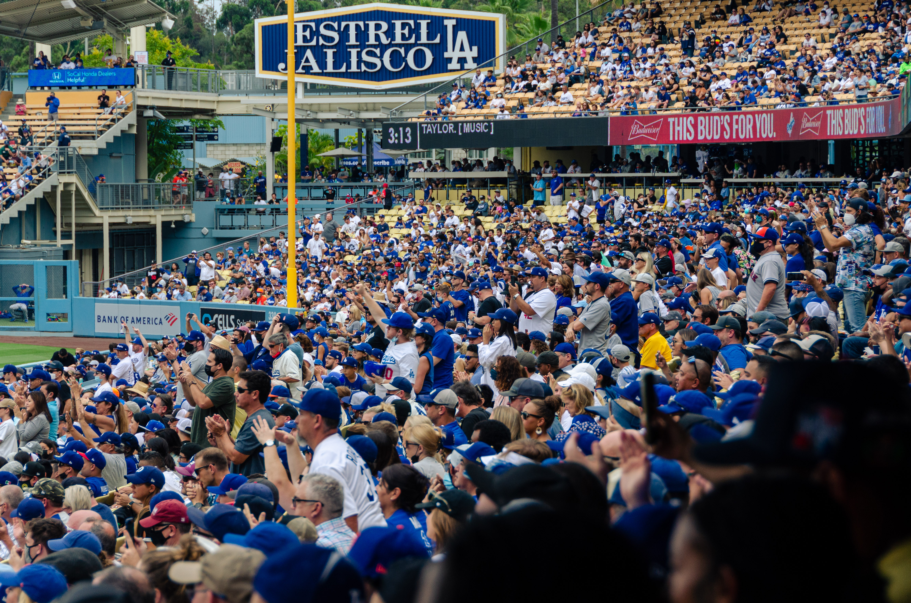
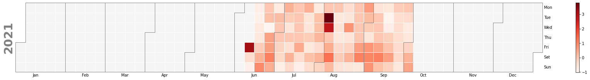

import BlogShareContainer from '../../../components/BlogShareContainer'

<BlogShareContainer  github = "https://github.com/benbrill/Stubhub"/>

I'm a big Dodgers fan. And sports fan in general. So I like to go to sports games. But going to a bunch of games equals spending a bunch of money. So I often find myself
trying to find the best ways to save money while also getting to go to as many games as I can.

The majority of costs going to a game comes from purchasing tickets (maybe parking eats up a big chunk of spending nowadays as well). So naturally, to reduce costs, I need
to find the cheapest tickets. 

Apps like Gametime market themselves as the cheapest way to buy tickets, as long as you are willing to risk waiting until gametime to purchase them. Their logic is that as the
game time approaches, sellers will be more likely to reduce their prices on their tickets to ensure that their tickets are sold and that they can net at least some profit.

But, I found that every time I browsed Gametime, ticket prices rarely had a dramatic decrease from their prices a couple days before. So I was curious whether their logic actually held up;
whether the idea that ticket prices decrease as you get closer to the event time was a myth or the truth.

# Getting the data

While Gametime does not have a readily accessible way of systematically obtaining their ticket prices, I figured that this logic would hold up with any second-hand ticket
broker if it turned out to be true. I went to Stubhub instead, since they have a relatively easy-to-use API. Stubhub also tended to have not only the most stock of tickets out of 
ticket brokers I checked (Gametime, VividSeats, and SeatGeek), but also the cheapest tickets. 

I wrote a `python` script that would scrape ticket data two times a day (5 a.m. and 5 p.m.) for every Los Angels Dodgers, San Francisco Giants, and Los Angeles (Anaheim) Angels home game. 
The scraper would store in an `SQL` Database the time of extraction, the number of days remaining before the game, the lowest ticket price available, the lowest ticket price available including fees,
 and the number of tickets remaining. 

Overall, I tracked the prices of 153 games across 81 days.

# Difference from Initial prices

One way we can quantify a change in price is a change from the initial listing price. That is, the change from the price of a ticket to a game the first time the scraper was run. 
We can define the "final price" of a ticket as the price of the ticket at the last time the scraper was run before the event occurred. All prices used below include fees, since 
that's what we have to pay out of pocket anyway

| Team    | Average Initial Price | Average Final Price | Average Percent Decrease |
|---------|-----------------------|---------------------|----------------|
| Dodgers | $40.16                | $38.48              | 4.37%          |
| Giants  | $46.51                | $35.25             | 31.97%         |
| Angels  | $20.27               | $14.39              | 40.87%         |

We see that ticket prices from all three teams have a lower final price than initial price. However, the Dodger ticket prices tend to be less volatile than the Giants and Angels
prices. In fact, Giants and Angels tickets have a very similar percent decrease. 
Dodger ticket prices also tend to be the highest closest to game time by a slight margin, even though Giants tickets were initially the most expensive. 

The Graph below the average percent difference in price per team for each day leading up to gametime. The more negative the percentage is, the cheaper the prices are at that time 
from the initial listed price.

import SummaryGraph from '../../../components/ticket_graphs/SummaryGraph'

<SummaryGraph metric = "diff_initial"/>

Again, compared to the other teams, the Dodgers line is the most flat, with the least change from the initial listed price overall. However, among all three teams, it appears
that buying tickets with 0 days remaining until game time is not the cheapest option. The biggest dips around gametime appear around the 2 day mark instead of the 0 day mark.

# Plan Ahead or Impromptu Games?

Even if tickets are the cheapest from their initial listed price two days out from gametime, that still might not be enough notice for people to work out all the logistics of 
attending a sporting event. Instead of comparing prices to the very first listed price, let's compare them to the prices of tickets a week out from gametime. 

import SevenGraph from '../../../components/ticket_graphs/SevenGraph'

<SevenGraph />

Across the board, there isn't much of a difference between purchasing your tickets seven days out or purchasing them sooner. This could mean that ticket prices have already
reached their floor or that sellers really don't adjust prices a week before the game.

Dodgers ticket are slightly more expensive (~2%) the day of the game than they were a week before the game where Angels tickets are a near opposite (5.8%). 
Giants tickets are 1% cheaper the day of the game than they were a week before the game. 

However, in all stadiums, it is cheaper to buy tickets 1 or 2 days out from gametime when using the price 7 days out as a benchmark.

# Which away teams have the most demand?

Especially in MLB, certain visiting teams can have more pull for fans to come than other teams. Usually, this happens for one of two reasons: a visiting team is rivals with the
the home team or the visiting team is a historically good team. For instance, we would expect to see more demand for Angels tickets at Dodgers game since the two teams are rivals
that play in the annual Freeway series every year. Or we would expect to see increased demand for Yankee away games across the board, since the Yankees are one of the most 
storied franchises not just across baseball but across professional sports.

## Measuring Demand through ticket prices

We will measure demand through the average price of the tickets for a visiting team.

In order to normalize the ticket prices for visiting teams across the three different home teams I tracked, we will use z-scores. Z-scores represent the number of standard
deviations a value is from the mean. The z-scores were calculated for the grouped mean of the ticket prices for each of the three home teams. The more positive the z-score,
the more expensive the tickets were than average. The more negative the z-score, the cheaper the tickets were than average.

It is important to note that these z-scores reflect average ticket prices tracked across **all** the days leading up to the game, not just the most recent tracked price. 
That means this pattern could shift if we just look at the most recent prices for each game a visiting team plays. You can toggle that with the buttons below. The overall z-scores
decrease, but also the teams at the top and bottom of the leaderboard.

import AwayTeamZScores from '../../../components/ticket_graphs/AwayTeamZScores'

<AwayTeamZScores />

The Yankees have the most expensive tickets across the three stadiums. This is to be expected. The Dodgers also pull a decent amount of demand for tickets, since they are also
a historically good team and have rivalries with both the Angels and Giants. The Angeles stand in third place, but this is likely due to their rivalry with the Dodgers. The
Angels would likely not have this high of a z-score if averages were calculated across all 29 other teams. 

At the bottom of the list we have the Arizona Diamondbacks. The D-backs struggle with attendance at home, so it would make sense that they would struggle to pull fans in
on the road. In addition, the Diamondbacks were the worst team in MLB this year. So it makes sense that not many people would want to go and see them play. 

Notice the Yankees have a sizeable drop in prices around gametime. This is likely due to the fact that the Yankee games recorded took place at Yankee stadium, which has
significant drops in prices around gametime.

## Measuring demand through ticket stock

Since demand is inversely related to supply, we can use the supply of tickets to measure demand. We will look at the average amount of tickets remaining closest to gametime, 
and normalize them using z-scores, as the different ballparks have different amounts of tickets remaining due to differing capacities.

Ideally, we would see the inverse relationship between supply of tickets (tickets remaining at gametime) and demand (price of tickets)

import SupplyDemandZScores from '../../../components/ticket_graphs/SupplyDemandZScores'

<SupplyDemandZScores />

We can see that the teams that have the cheapest tickets also have the least tickets remaining. This makes sense, as cheaper tickets would induce demand, resulting in less stock
at gametime. As such, we don't see that inverse relationship we would expect. Ticket prices is perhaps a better way to measure demand than stock.

# When are tickets most expensive?

Other than proximity to the game, another variable that could potentially affect ticket prices is the date of the game itself.  For instance, if a game is held on a weekend, 
then the ticket prices will be higher than if it is held on a weekday. Or a game in the middle of summer could be more expensive than a game at the end of September, when
most school are back in session. 

We will again use z-scores to normalize the data across the three ballparks.

The first thing that immediately pops out are the three extremely red squares, or outliers. These dates are August 3, June 11, and August 4, in descending order of z-score.
These dates don't really have a particular importance, except that the June 11 game occurred before COVID capacity restrictions were lifed (June 15). Because of the lower 
supply of seats, prices might have been higher for those games.

We also see that Saturday happens to be the most expensive day of the week to attend games. People are off from work and school so this makes sense. Sunday games are less
expensive than Saturday games, likely due to the fact that many Sunday games are day games. And not many people would willingly pay to sit in the blistering sun for a couple
hours and watch baseball.

Ticket prices are also relatively random in their pattern through the majority of the summer. However, toward the fourth week of September we see that ticket prices stabilize
to be cheaper than the rest of the summer. This pattern continues on to the end of the regular season. 

# Limitations

The largest limitation is the data set itself. It only just about one summer of baseball -- albeit an unusual summer with COVID still around. As such, it is difficult to see
whether these trends will persist or change in future seasons. Only time will tell.

In addition, this data set only covers the home games of three teams. In the future, I hope to expand this to all 30 teams (with more API calls), but in the meantime, these
are the only teams we can draw conclusions for.

One potential area for growth could be a machine learning algorithm to predict ticket prices with several of the predictors we have discussed. Again, the only issue is the size
of the data set. 

